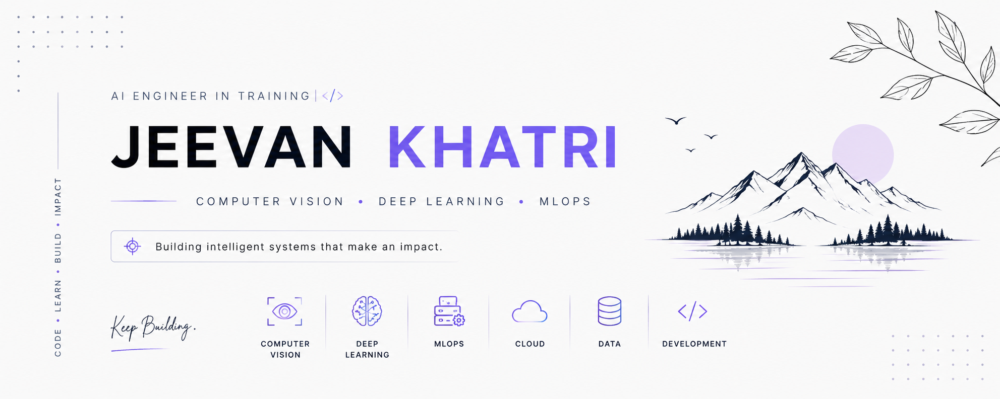

<!-- ============================ PROFILE BANNER ============================ -->
<p align="center">
  
</p>

<div align="center">

```ansi
[36m> initializing AI engineer profile...[0m  [32m[ OK ][0m
```


</div>

---

## ` >_ ` whoami

```python
class JeevanKhatri:
    def __init__(self):
        self.role = "AI Engineer in Training"
        self.education = "BSc Computer Science with AI @ Sunway College"
        self.location = "Nepal 🇳🇵"
        self.focus = [
            "Computer Vision",
            "Deep Learning",
            "MLOps",
            "IoT Automation",
            "Applied AI Systems"
        ]
        self.currently_building = "TerraNode - smart agriculture automation platform"
        self.mindset = "learn → build → test → improve"

    def mission(self):
        return "Build intelligent systems that make real-world impact."
```

---

## ` >_ ` ./neofetch

<table>
<tr>
<td>

```bash
 jeevan@github ~ %
────────────────────────────
OS........ macOS · Linux
Shell..... zsh · bash
Editor.... VS Code
Domain.... AI / CV / MLOps / IoT
Now....... Building real-world AI projects
Status.... Learning by shipping
```

</td>
<td>

```diff
+ Computer Vision
+ Deep Learning
+ MLOps Pipelines
+ IoT Automation
+ Cloud Deployment
+ Data Engineering Basics
! Always building, always improving
```

</td>
</tr>
</table>

---

## ` >_ ` cat tech_stack.json

<div align="center">


</div>

---

## ` >_ ` ls ./featured_projects

```text
📂 featured_projects/
 ├── 🌱 TerraNode/              # smart agriculture + IoT automation
 ├── 🧠 CIFAR-10-MLOps/          # Airflow + MLflow + FastAPI + Docker
 ├── 👁️ Computer-Vision/         # OpenCV + image classification projects
 ├── 📊 Data-Pipelines/          # PostgreSQL + Redis + experiment tracking
 └── ⚙️ Embedded-Systems/        # ESP32 sensors, relay control, automation
```

### 🌱 TerraNode
AI-powered smart agriculture platform using ESP32, soil sensors, pH sensing, light sensing, OLED display, and automated pump control.

### 🧠 CIFAR-10 MLOps Pipeline
End-to-end deep learning pipeline with Airflow orchestration, MLflow experiment tracking, FastAPI serving, PostgreSQL, Redis, Docker, and AWS deployment.

### 👁️ Computer Vision
Projects focused on image classification, OpenCV workflows, CNNs, and practical computer vision systems.

---

## ` >_ ` current_focus.yml

```yaml
learning:
  - Deep Learning
  - Computer Vision
  - MLOps
  - Model Deployment
  - IoT + AI Integration

building:
  - real-world AI projects
  - cleaner ML pipelines
  - smart automation systems
  - internship-ready portfolio projects

values:
  - consistency
  - discipline
  - curiosity
  - practical problem solving
```

---

## ` >_ ` git log --stat

<div align="center">


<br/>


<br/>


</div>

---

## ` >_ ` ./connect.sh

<div align="center">

<a href="https://linkedin.com/in/jeevan-khatri"></a>
<a href="https://github.com/jeevankhatri001"></a>
<a href="https://www.instagram.com/trainwithjeevan/"></a>

<br/><br/>

```bash
$ echo $CONTACT
> jeevankhatri001@gmail.com
```


</div>

---

<div align="center">

```text
Code. Learn. Build. Impact.
```

</div>
